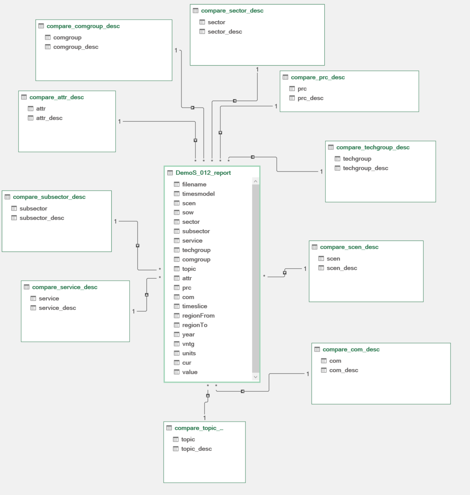
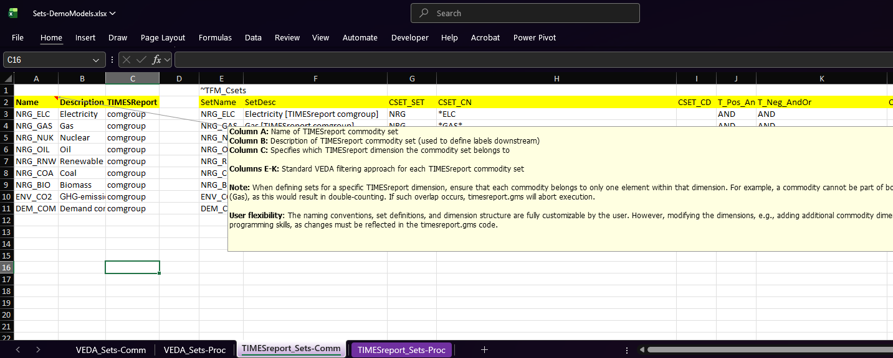
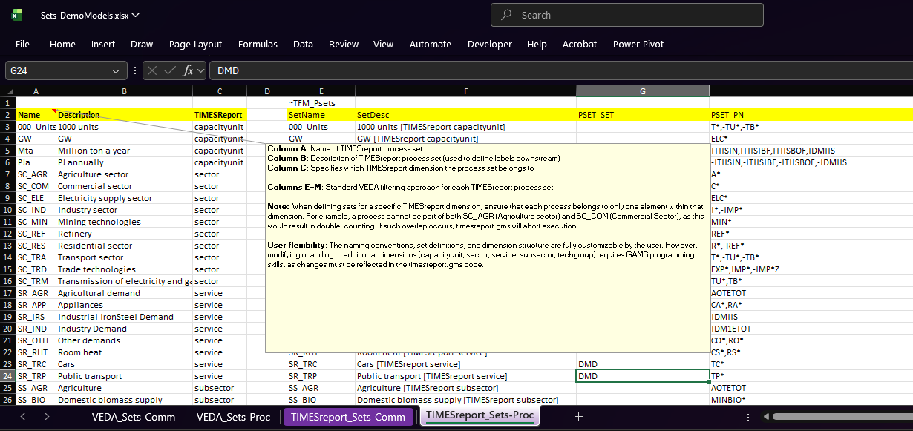
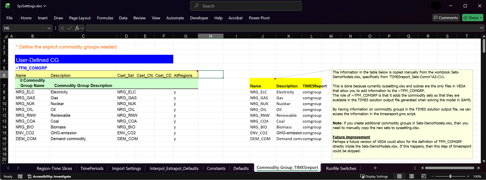
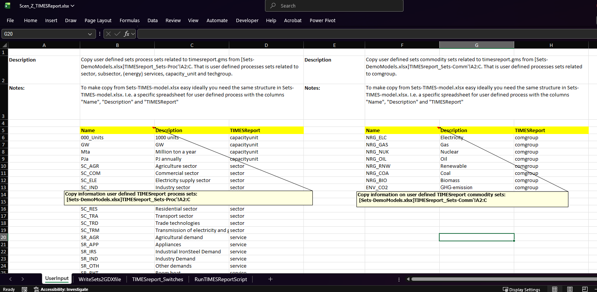
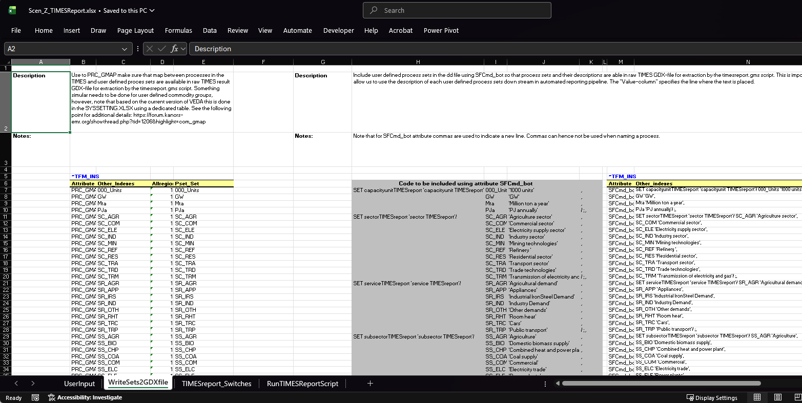
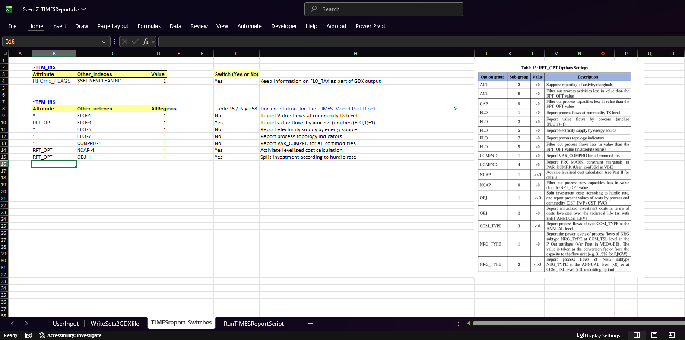
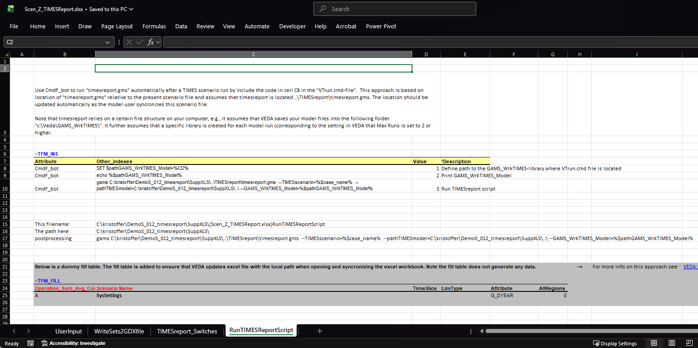
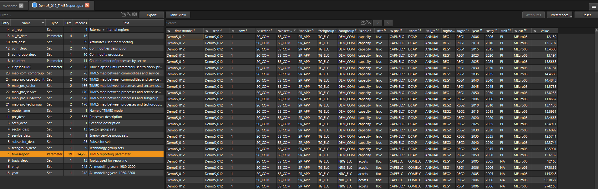

# TIMESreport

> An open-source, lightweight and efficient reporting system for TIMES energy models that transforms complex model outputs into a pivot and (relational) database ready format ideal for analysis and visualization developed by Energy Modelling Lab. This repository demonstrates how TIMESreport can be implemented for a TIMES-demo-model.

## Copyright and License

**Copyright © 2023-2025 Kristoffer S. Andersen**\
Energy Modelling Lab \| [kristoffer\@energymodellinglab.com](mailto:kristoffer@energymodellinglab.com)

**License:** GNU General Public License v3.0

This software is free and open source. You are free to:

```         
✓ Use it for any purpose

✓ Study and modify the source code

✓ Redistribute copies

✓ Distribute modified versions
```

Under the condition that derivative works are also licensed under GPL v3.0.

See `NOTICE-GPLv3.txt` or visit [gnu.org/licenses/gpl-3.0.html](https://www.gnu.org/licenses/gpl-3.0.html)

**Disclaimer:** Provided "AS IS" without warranty of any kind.

## Table of Contents

-   [Introduction](#introduction)
-   [Motivation](#motivation)
-   [Functionality](#functionality)
-   [Prerequisites](#prerequisites)
-   [Library Structure](#library-structure-core-timesreport-structure)
-   [Component Reference](#component-reference)
-   [Quick Start](#quick-start)

------------------------------------------------------------------------

## Introduction {#introduction}

TIMESreport is a GAMS-based reporting solution designed to address the challenges of working with high-resolution TIMES energy system models. It provides a standardized, portable data structure that works across all model scales — from municipal to global — while dramatically reducing data processing overhead and enabling seamless cross-model collaboration.

The tool operates as a post-processing script that runs automatically after TIMES model execution, transforming the TIMES solution output into a structured, pivot and database ready format suitable for analysis in Excel PivotTables, Power BI, Tableau, Python, R, or as input into a relational databases like DuckDB.

The figure below illustrate the relational format that can be generated based on the tool. The main TIMESreport data is a tidy dataframe consisting of 19 dimensions (the number of dimensions are flexible and can be adjusted to fit the user needs). This main TIMESreport dataframe is augmented by including additional dataframes which includes description for main dimensions in the main TIMESreport dataframe. The labels makes it easy to make elaborate illustration of the data within Excel or any visualization app you may wish to use.

The next step for the reporting tool is to develop a version that supports stochastic modeling within the TIMES modeling framework. To prepare for this development, the dimension "sow" (state-of-world) has recently been added to the main TIMESreport parameter. By including this additional dimension, the visualization app can be prepared to support outputs from stochastic TIMES modeling. When running TIMES as a deterministic model, sow = 1.



**Key Benefits:**

-   **8x reduction in data storage** compared to traditional VEDA reporting workflow
-   **Faster processing time** for high-resolution models
-   **Universal compatibility** across all TIMES model scales and types
-   **Built-in data validation** to ensure output integrity
-   **Cross-model collaboration** infrastructure for multi-team projects

## Motivation {#motivation}

### The TIMES Modeler's Dilemma

Rich, comprehensive results from TIMES models are often locked in complex data structures that are difficult to access, share, and analyze efficiently. As TIMES models evolve to include higher temporal resolution (hourly timeslices) and greater spatial detail (multiple regions), traditional reporting approaches face three critical challenges:

### 1. Make it FAST

-   **Challenge:** High-resolution models generate massive data volumes that are slow to process and store
-   **Impact:** A typical hourly model with 104 regions can generate 7+ GB of reporting data using traditional workflows in VEDA, taking 7-8 minutes to process
-   **Solution:** TIMESreport reduces this to \<850 MB and processes in under 2 minutes and even faster if you make a more selective version of timesreport.gms

### 2. Make it PORTABLE

-   **Challenge:** Different model scales (municipal, regional, national, global) require custom reporting solutions
-   **Impact:** Teams waste time adapting reports for different model types, limiting collaboration
-   **Solution:** Single data structure works universally across all TIMES model scales—from TIMES-Bornholm (municipal) to TIMES-Nordic (national) to global models

### 3. Make it NAVIGABLE

-   **Challenge:** TIMES' relational data structure doesn't align with how analysts want to explore results
-   **Impact:** Extensive data reshaping needed before analysis can begin
-   **Solution:** Leverages VEDA's set definitions to create intuitive, visualization-ready data structures with no reshaping required

## Functionality {#functionality}

### Core Workflow

The TIMESreport workflow integrates seamlessly with your existing TIMES modeling process:

```         
┌─────────┐    ┌──────────────┐    ┌──────────────┐    ┌──────────┐
│  VEDA   │  → │ Solve TIMES  │  → │ TIMESreport  │  → │ Analysis │
│ Setup   │    │    Model     │    │   (auto)     │    │  Tools   │
└─────────┘    └──────────────┘    └──────────────┘    └──────────┘
```

1.  **VEDA Setup**: Configure your model with TIMESreport scenario file
2.  **Model Execution**: TIMES solves normally through VEDA
3.  **Automatic Processing**: TIMESreport.gms runs immediately after solve
4.  **Analysis Ready**: Data available in CSV/GDX format for your analysis tools

## Prerequisites {#prerequisites}

### Required Software

-   **TIMES model** (any version compatible with VEDA)
-   **VEDA** (VEDA 2.0 or later recommended)
-   **GAMS** (version used by your TIMES installation)

### Required Knowledge

-   Basic familiarity with TIMES modeling
-   Understanding of VEDA scenario files
-   Basic knowledge of VEDA set definitions
-   Familiarity with at least one analysis tool (Excel, Power BI, Python, or R)

### System Requirements

-   Disk space: Standard TIMES model requirements
-   RAM: Standard TIMES model requirements
-   Processing: No additional requirements beyond GAMS software

------------------------------------------------------------------------

## Library Structure (core TIMESreport structure) {#library-structure-core-timesreport-structure}

```         
/
├── Sets-DemoModels.xlsx
├── SysSettings.xlsx
├── SuppXLS/
│   └── Scen_Z_TIMESReport.xlsx 
└── TIMESreport/
    ├── timesreport.gms                         # TIMESreport script
    ├── TIMESreport_DemoS_012.xlsx              # Excel file that reads csv-files and set maps
    ├── SolverStats/                            # Library stores solver statistics from each run
    ├── tempData/                               # Library stores gdx with dummy and duplicate sets info
    ├── GDX/                                    # Library stores the actual timesreport gdx file
    └── bat-scripts/
        ├── create_scen_desc_gms.bat            # Extract scenario description from vtrun.cmd
        └── runMerge_GDX2CSV_TIMESreports.bat   # Merge gdx files and generate csv-files
```

------------------------------------------------------------------------

## Component Reference {#component-reference}

### Core Components

1.  [**Sets-DemoModels.xlsx**](#1-sets-demomodelsxlsx) : Sets model-specific user defined commodity and process set definitions used in the TIMESreport\]
2.  [**SysSettings.xlsx**:](#2-syssettingsxlsx) Used for `~TFM_COMGRP` specification related to commodity sets defined in Sets-DemoModels.xlsx
3.  [**Scen_Z_TIMESReport.xlsx**:](#3-scen_z_timesreportxlsx) TIMES/VEDA scenario file which 1) automatically runs timesreport.gms, 2) generates commodity and sets definitions and 3) sets TIMES reporting options
4.  [**timesreport.gms**](#4-timesreportgms): Collect all TIMES model data and writes it into a pivot and database ready format
5.  [**Helper functions**](#helper-functions): Helper scripts for capturing scenario descriptions and doing merge gdx and csv-creation

### 1. Sets-DemoModels.xlsx {#1-sets-demomodelsxlsx}

**Purpose:** Used to define model-specific user defined commodity and process set definitions used in the TIMESreport

**Description:** - Structure of the file - What sets are defined - Naming conventions - How sets map to the model





**Future improvement:** - The current TIMESreport also includes capacityunit as a dimensions. The reason is that information on capacity units are not directly available in TIMES solution gdx file. Hence we add this information manually. Alternative solutions are being explored.

### 2. SysSettings.xlsx {#2-syssettingsxlsx}

**Purpose:** TIMES/VEDA defining commodity groups in TIMES solution output file

**Description:** - Role in the workflow - `~TFM_COMGRP` specification - Makes sure your are written into the TIMES output file so that the set definition are available for timesreport.gms - Relationship to other components

**Future improvement:** - Perhaps a future version of VEDA could allow for the definition of \~TFM_COMGRP directly inside the Sets-DemoModels.xlsx. If this happens, then this step could be skipped.



### 3. Scen_Z_TIMESReport.xlsx {#3-scen_z_timesreportxlsx}

**Purpose:** TIMES/VEDA scenario file that runs the TIMESreport-script and provides set definitions so that they are available for TIMESreport.

**Description:** - File structure - How it integrates with VEDA - Key worksheets/sections - Configuration options

**Scen_Z_TIMESReport.xlsx consists of the four sheets**:

1.  **Userinput**: Manually copying user defined TIMES report process and commodity sets from Sets-DemoModels.xlsx to Scen_Z_TIMESreport.xlsx



2.  **WriteSets2GDXfile**: Writes PRC_GMAP and set descriptions into TIMES solution output so that this information is available for timesreport.gms (no user input required)



3.  **TIMESreport_Switches**: Set TIMES reporting switches to make 1) that TIMES report value flow by process, 2) Activate levelized cost calculations and 3) split investments according to hurdle rate (no user input required)



4.  **RunTIMESReportScript** - Use the CmdF_bot-attribute to make sure that timesreport.gms runs automatically after solving the TIMES model (no user input required)



**Important Notes:** - Must be synchronized when updating VT-files or SubRES - How it interacts with other components

### 4. timesreport.gms {#4-timesreportgms}

**Purpose:** Purpose of the timesreport script is to collect all TIMES model data and writes it into a pivot and database ready format based on the user defined processes and commodity sets



**Description:** - A detailed description of the timesreport.gms is written into the GAMS code itself.

### Helper Functions {#helper-functions} {#helper-functions}

TIMESreport comes with two helper functions:

1.  **`.\TIMESreport\bat-scripts\create_scen_desc_gms.bat`**: Helper script used as part of timesreport.gms to acquire the scenario description from the vtrun.cmd file (the file responsible for executing the TIMES model)

2.  **`.\TIMESreport\bat-scripts\runMerge_GDX2CSV_TIMESreports.bat`**: Helper script used after timesreport.gms to merge existing timesreport gdx-files and convert the gdx data into csv-files that can be viewed in the TIMESreport_DemoS_012.xlsx

## Quick Start {#quick-start}

### For an Existing TIMES Model

**Step 1: Add TIMESreport to Your Model Folder**

```         
YourModelssFolder/
├── Sets-YourModel.xlsx          # Your existing sets file
├── SysSettings.xlsx             # Your existing settings file
├── SuppXLS/                     # Your existing folder
│   └── Scen_Z_TIMESReport.xlsx  # <- Add this (Step 2)
└── TIMESreport/                 # <- Add this folder (Step 1)
    ├── timesreport.gms          
    ├── GDX/
    ├── tempData/
    ├── SolverStats/
    └── bat-scripts/
```

**Step 2: Configure Scenario File**

1.  Copy `Scen_Z_TIMESReport.xlsx` to `SuppXLS/` folder
2.  Add it to your scenario group in VEDA

**Step 3: Define Your Reporting Sets**

1.  Open `Sets-YourModel.xlsx`
2.  Define commodity groups (e.g., "Electricity", "Heat", "Transport")
3.  Define process groups (e.g., "RenewableTech", "FossilTech")

**Step 4: Update SysSettings**

1.  Open `SysSettings.xlsx`
2.  Add your commodity groups to the `~TFM_COMGRP` specification

**Step 5: Link Sets to Scenario File**

1.  Copy commodity and process groups from Step 3
2.  Paste into `Scen_Z_TIMESReport.xlsx` → "Userinput" sheet

**Step 6: Run Your Model**

1.  Synchronize in VEDA
2.  Run model with `Scen_Z_TIMESReport` included
3.  Check `./TIMESreport/GDX/` for output files

**Step 7: Copy "TIMESreport_DemoS_012.xlsx"**

Copy to folder "YourModelFolder/TIMESreport/" and rename to TIMESreport_YourModel.xlsx

### Verification

After your first run, verify TIMESreport worked:

-   [ ] Check `./TIMESreport/GDX/` contains a `.gdx` file
-   [ ] Check `./TIMESreport/SolverStats/` contains a `.txt` file
-   [ ] Run `runMerge_GDX2CSV_TIMESreports.bat` to generate CSVs
-   [ ] Open `TIMESreport_YourModel.xlsx` to view csv-files